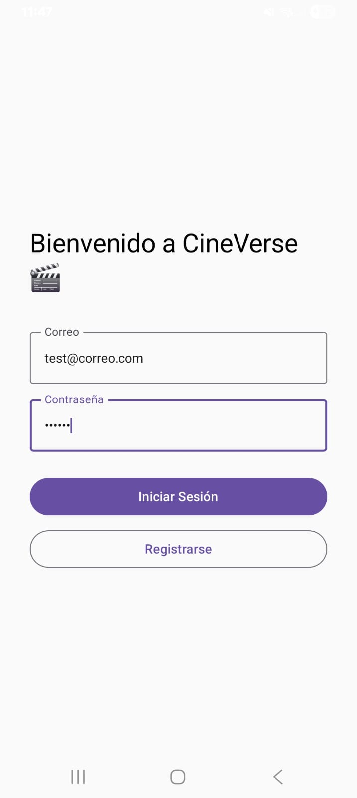
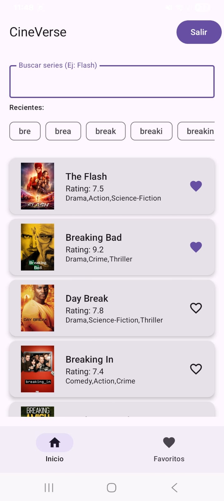
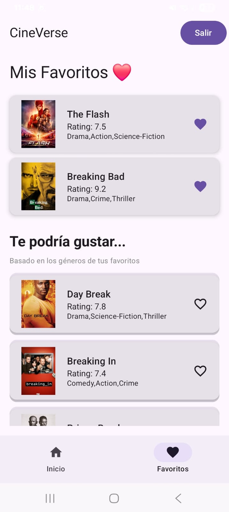
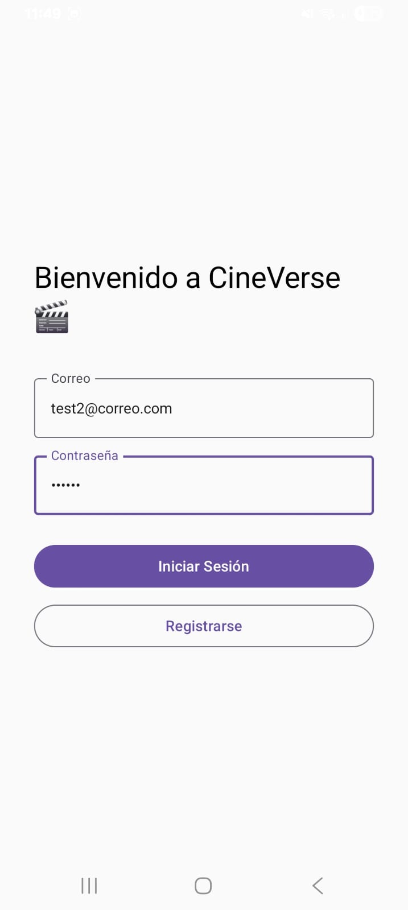
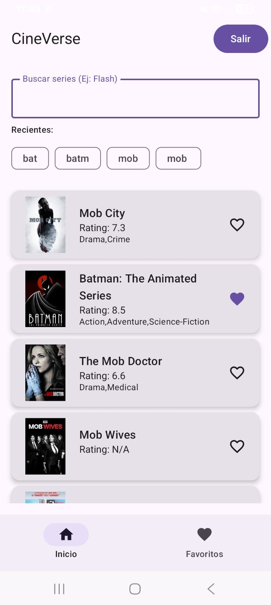
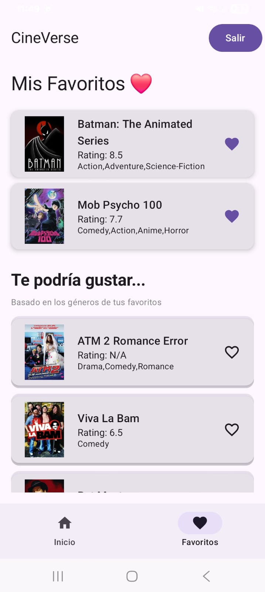
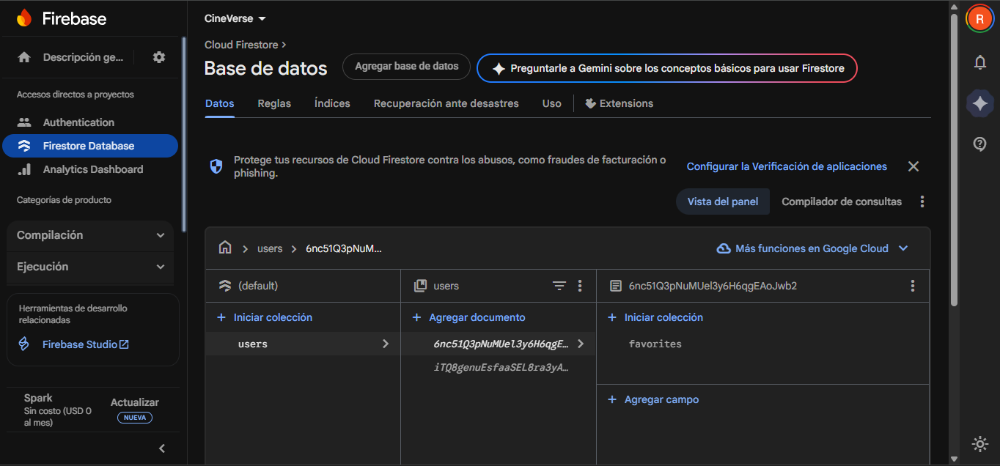
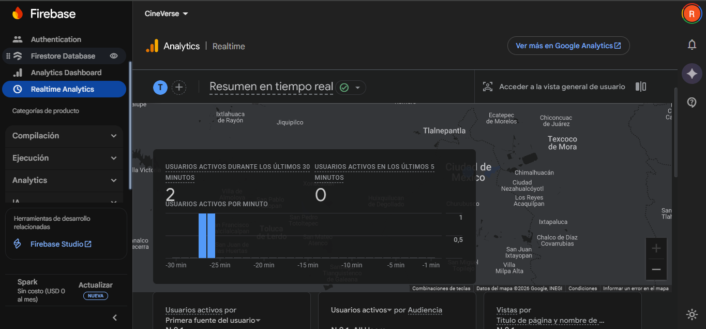

# 🎬 CineVerse - App de Búsqueda y Recomendación de Series

Aplicación Android desarrollada con **Jetpack Compose**. Permite buscar series, gestionar favoritos y recibir recomendaciones personalizadas, sincronizando datos en la nube con Firebase.

## 📱 Características Principales

* **🔍 Búsqueda:** Búsqueda en tiempo real sobre la base de datos en Firebase.
* **❤️ Gestión de Favoritos:**
    * Persistencia local inmediata.
    * Sincronización en la nube con **Firebase Firestore**.
    * Soporte multi-usuario (cada usuario ve sus propios favoritos).
* **🤖 Sistema de Recomendaciones:** Algoritmo que sugiere series basadas en los géneros de los favoritos del usuario.
* **🕒 Historial de Búsqueda:** Guardado local de términos recientes.
* **🔐 Autenticación:** Login y Registro de usuarios mediante **Firebase Authentication**.

## 🛠️ Herramientas Tecnológicas

* **Lenguaje:** Kotlin
* **UI:** Jetpack Compose (Material Design 3)
* **Arquitectura:** MVVM (Model-View-ViewModel) + Clean Architecture (Capas de Data, Domain, UI).
* **Inyección de Dependencias:** Manual (Factory Pattern).
* **Asincronía:** Coroutines & Flow.

### Librerías Utilizadas
1.  **Room:** Base de datos local SQL.
2.  **Retrofit 2:** Cliente HTTP para la API de TVMaze.
3.  **Firebase Auth:** Gestión de sesiones de usuario.
4.  **Firebase Firestore:** Base de datos NoSQL en la nube.
5.  **Coil:** Carga asíncrona y caché de imágenes.
6.  **KSP:** Procesamiento de anotaciones moderno (reemplazo de KAPT).

## 🔌 API Utilizada
Los datos de las series se obtienen de la API pública de **TVMaze**:
* Endpoint: `https://api.tvmaze.com/search/shows?q={query}`

## 🚀 Instalación y Configuración

**Nota Importante:** Este repositorio no incluye el archivo `google-services.json` por razones de seguridad.

1.  Clonar el repositorio.
2.  Crear un proyecto en [Firebase Console](https://console.firebase.google.com/).
3.  Habilitar **Authentication** (Email/Password) y **Firestore**.
4.  Descargar el archivo `google-services.json` de Firebase.
5.  Pegar el archivo en la carpeta `app/` del proyecto.
6.  Sincronizar Gradle y ejecutar en un emulador/dispositivo.

## 📸 Capturas de Pantalla 
Usuario "test@correo.com"
| Login de la App | Catalogo de la API | Favoritos y Recomendaciones |
|:---:|:---:|:---:|
|  |  |  |
| *Login con correo y contraseña.* | *Catalogo de la API con historial de búsqueda.* | *Favoritos y recomendaciones del usuario.* |

Usuario "test2@correo.com"
| Login de la App | Catalogo de la API | Favoritos y Recomendaciones |
|:---:|:---:|:---:|
|  |  |  |
| *Login con correo y contraseña.* | *Catalogo de la API con historial de búsqueda.* | *Favoritos y recomendaciones del usuario.* |

Base de datos de la app en Firebase 🔥

Usuarios de la app en Firebase 🔥

